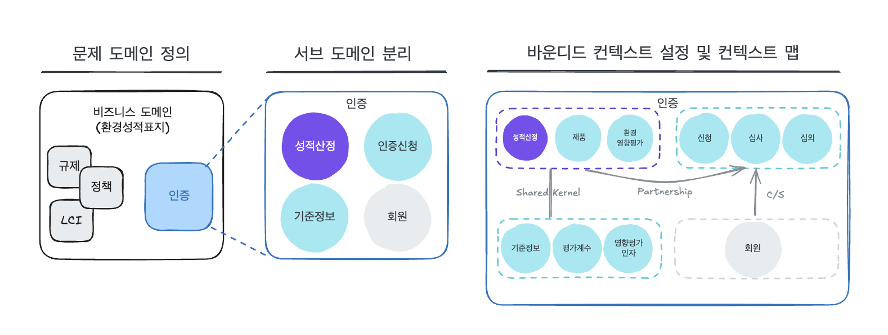

## 도메인 주도 설계에 관심을 갖게 된 계기

SI 회사에 입사하자마자 어느 공공 SI 프로젝트에 투입되었다.  
프로젝트를 진행하면서 주어진 자원(인력, 일정 등)이 부족하다는 이유로 이해관계자와의 어떠한 대화도 없이 구 솔루션과 동일한 기능 구현에만 집중했었다.

우리팀은 개발할 시간조차 부족하기 때문에 고객과 만나서 대화하는 것은 시간 낭비이며, 주요 기능을 모두 개발한 상태에서 고객과 대화가 가능하다고 판단했다.  
(오히려 고객은 프로젝트 초기부터 개발자와의 대화를 원했다...)

심사숙고한 설계 없이 소프트웨어 개발에만 박차를 가했다.  
분석•설계 단계에서 기존의 데이터 모델링을 그대로 복사하였고 코드 또한 사용하는 툴 또는 언어에 맞추어 AS-IS 코드를 그대로 답습했다.  
**"어떻게 동작하는지가 아니라 어떻게 생겼는가에만 집중했다.**

고객과의 미팅을 미루고, 일정에 쫓겨 야근이 일상이었다.  
고객의 방해(???)가 없으면 더 빨리 진행될 것이라고 생각했지만, 시간이 지날수록 스파게티 코드로 인해 유지보수 난이도가 높아졌고 개발 속도는 점점 더뎌졌다.  
하나의 기능을 개발하거나 기존 기능을 수정하면 예상치 못한 문제가 연달아 발생하는 악순환이 반복되었다.

프로젝트의 3/4이 지난 시점에서야 고객과 직접 만날 수 있었다. 고객과 대화를 하면서 점차 도메인을 이해하게 되었지만 이미 코드가 복잡하게 얽혀 있어 수정이 불가능했다.
코드만 들여다보며 기능을 구현하는 것이 최선이라 생각했지만, 결국 나는 도메인에 대한 지식이 전혀 없는 상태에서 코드를 작성하고 있었다.

만약 프로젝트 초기부터 도메인을 제대로 분석하고 설계했다면 이런 혼란을 줄일 수 있었을 것이다.

## 도메인 주도 설계를 알았다면 어떻게 했어야 했을까?

도메인 주도 설계를 적용했다면 다음과 같은 과정으로 접근했을 것이다.

### 1. 문제 도메인 정의 및 서브 도메인 분리

- 제안요청서를 분석하여 문제 도메인을 **인증**으로 추출
- 인증 도메인을 **인증신청, 환경성적 산정, 기준정보, 회원** 등 서브 도메인으로 분할
- 서브 도메인을 핵심, 일반, 지원으로 분류
  - 도메인 전문가와 유비쿼터스 언어룰 사용하여 지식 탐구 및 커뮤니케이션을 통해 문제 공간을 식별
  - 하위 도메인을 환경성적 산출(핵심), 인증신청(지원), 기준정보(지원), 회원(일반)로 분류

### 2. 바운디드 컨텍스트(bounded-context) 설정 및 컨텍스트 맵 작성

- 바운디드 텍스트 설정을 통한 도메인 경게 명확화

  - **환경성적 산정** → 제품 정보(PRODUCT), 환경영향평가(LCA)
  - **인증신청** → 신청, 심사, 심의
  - **기준정보** → LCI DB, 평가계수, 영향평가인자

- 컨텍스트 맵(context-map)을 작성하여 바운디드 컨텍스트 간 매핑

## 프로젝트에서 부족했던 점

돌이켜보면 프로젝트 초반에 도메인 전문가과 협력하여 도메인을 이해하는 과정이 필요했다.  
하지만 이를 간과한 결과로 다음과 같운 부족한 점이 있었다.

#### 도메인에 대한 이해 부족

- 도메인 지식을 코드에 녹이지 못함

#### 유비쿼터스 용어 정리 미흡

- 고객 뿐만 아니라 개발자 간에도 서로 다른 용어를 사용하여 개념 정리에 혼란이 생김

#### 바운디드 컨텍스트 경계 미설정

- 기능 변경 시 사이드 이펙트 발생

## DDD 적용 시 기대할 수 있는 효과

도메인 모델을 먼저 정리했다면,

✅ 중복된 기능과 불필요한 복잡성을 줄이고  
✅ 변경에도 유연한 구조를 가질 수 있었으며  
✅ 결과적으로 프로젝트의 유지보수가 용이했을 것이다.

즉, 단순히 보기에만 잘 작동하는 코드가 아니라, 좀더 비즈니스의 복잡한 문제를 해결하기 용이한 코드를 만들 수 있었을 것이다.

## 💡 정리

첫 회사에서 대표님이 SI 프로젝트 투입 인원들과 매일 아침마다 해당 도메인에 대한 지식 탐구를 하셨다. 당시에는 개발하는 사람이 개발만 하면 되지 도메인에 대한 개념 공부를 왜 해야되나라는 불만을 가졌었다.

실무에서 고객과 의사소통을 하다보니 비즈니스 도메인을 이해해야 요구사항을 제대로 반영한 프로그램을 만들 수 있다고 느꼈다.

물론 설계가 단순한 프로젝트나 비즈니스 로직이 복잡하지 않은 곳에서는 적합하지 않지만 비즈니스 중심으로 소프트웨어를 설계하는 도메인 주도 설계의 사고방식은 어느 곳에서나 유용할 것이라고 생각한다.

## 📚 참고 자료

- 반 버논, _도메인 주도 설계 핵심_, 에이콘, 2017
- [DDD 뭣이 중헌디? (정명주)](https://youtu.be/6w7SQ_1aJ0A?si=G-5RVtLUxD0bVRHd)
