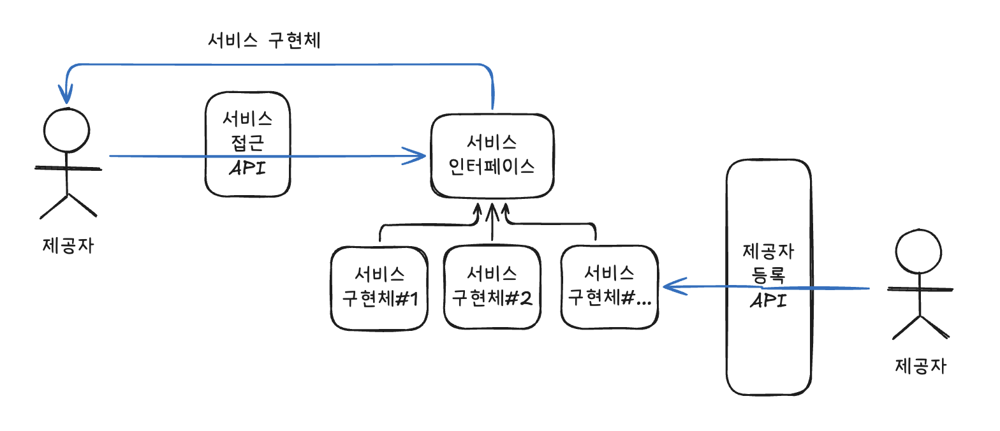

# 아이템 1 - 생성자 대신 정적 팩터리 메서드를 고려하라

정적 팩터리 메서드는 다음과 같은 장점이 있다

> **정적 팩터리 메서드의 장점**
>
> 1. 이름을 가질 수 있다
> 2. 호출될 때마다 인스턴스를 새로 생성하지 않아도 된다
> 3. 반환 타입의 하위 타입을 반환할 수 있다
> 4. 입력 매개변수에 따라 다른 객체를 반환할 수 있다
> 5. 반환할 객체의 클래스가 존재하지 않아도 된다

## 나는 실무에서 왜 생성자 대신 정적 팩터리 메서드를 사용했는가

내가 실무에서 정적 팩토리 메서드를 주로 사용하는 이유는 의미를 정확히 드러내서 코드를 읽는 사람으로 하여금 혼동하는 일이 없도록 하는 것이었다.

즉, 정적 팩터리 메서드를 사용할 때 장점 중 하나인 **이름을 가질 수 있다** 이었다.

### ① 이름을 가질 수 있다

클라이언트가 클래스의 인스턴스를 생성하는 기본적인 수단은 생성자를 이용하는 것이다.

```java
Car car = new Car();
```

생성자의 파라미터가 점점 많아질 경우, 사용자는 엉뚱한 생성자 API 호출할 가능성이 높다. 또한 코드를 읽는 사람도 의미를 이해하지 못해 클래스 설명 문서를 찾아야하는 경우도 발생한다.

날짜를 다루는 클래스인 LocalDate를 예시로 들어보자.

다음은 정적 팩터리 메서드를 이용해 날짜를 생성하는 코드이다.

#### 정적 팩터리 메서드 사용

```java
LocalDate now1 = LocalDate.of(2026, 3, 11);
LocalDate now2 = LocalDate.now();
LocalDate now3 = LocalDate.parse("2026-03-11");
LocalDate now4 = LocalDate.ofEpochDay(20523);

```

#### 생성자 사용

```java
LocalDate now1 = new LocalDate(2026, 3, 11);
LocalDate now2 = new LocalDate(System.currentTimeMillis());
LocalDate now3 = new LocalDate("2026-03-11");
LocalDate now4 = new LocalDate(20523);
```

하지만 이런 생성자는 의미를 이해하기 어렵다.
특히 만약 생성자를 사용했다면 `new LocalDate(2026)` 같은 코드가 등장할 수 있다. `2026` 값이 epoch day를 의미하는 건지 year를 의미하는 건지 코드를 읽는 사람은 클래스 설명 문서를 찾아봐야 알 수 있는 것이다.  
**따라서 한 클래스에 생성자가 여러 개 필요한 경우**, 생성자를 정적 팩터리 메서드로 바꾸고 **각각의 차이를 잘 드러내는 이름으로 지어주는 것이 좋다.**

## 또다른 장점을 알지 못했다

실무에서 또다른 장점을 알지 못하여 제대로 활용하지 못했다.

### ② 호출될 때마다 인스턴스를 새로 생성하지 않아도 된다

불변 클래스(immutable class)는 인스턴스를 미리 만들어 놓거나 새로 생성한 인스턴스를 새로 캐싱하여 같은 객체가 자주 요청되는 상황에서 성능을 향상시킨다.

```java
public class Collections {

    ...중략

    public static final List EMPTY_LIST = new EmptyList<>();

    public static final <T> List<T> emptyList() {
        return (List<T>) EMPTY_LIST;
    }

    ...생략
}
```

`Collections`은 빈 리스트를 반환할 때, `Collections.emptyList()`를 사용하여 이미 생성된 인스턴스를 반환한다. `List.of()` 또한 내부적으로 불변 컬렉션을 재사용하는 방식으로 동작한다.

예를 들어, 사용자의 주문 정보를 조회하는 상황을 가정하자.

```java
public List<Order> findOrders(Long userId) {
    List<Order> orders = repository.findByUserId(userId);

    if (orders.isEmpty()) {
        return Collections.emptyList();
    }

    return orders;
}
```

나는 조회한 결과값이 존재하지 않을 때, 객체 재사용보다는 불변 컬렉션을 반환하기 위한 용도로 `List.of()`를 반환했다.  
가끔 다른 개발자가 작성한 코드를 보면 `Collections.emptyList()` 또는 `List.of()`가 아닌 `new ArrayList<>()`를 반환하는 코드를 종종 본 적이 있다.
'인스턴스를 새로 생성해서 쓰네...'라고 생각하며 별 대수롭지 않게 넘어갔으나 객체를 재사용하지 않는다는 것을 알았다면 해당 개발자에게 알려줬을 것이다.

### ③ 반환 타입의 하위 타입 객체를 반환할 수 있는 능력이 있다.

구현 클래스를 공개하지 않고도 그 객체를 반환할 수 있어, API를 작게 유지할 수 있다. 클라이언트가 인터페이스만으로 객체를 다룰 수 있어, **변경에 용이**하다.

java 8 이전에는 인터페이스에 정적 메서드를 정의할 수 없었기 때문에 정적 팩터리 메서드를 인터페이스에 둘 수 없었다.

```java
public interface Animal {

    // 불가
    public static Animal dog() {

    }
}
```

구현 클래스가 외부에 노출될 수 밖에 없었기 때문에 **인스턴스화 불가 클래스**를 만들어서 구현 클래스를 package-private 클래스로 두어 숨겼다.

```java
public class Animals {

    private Animals() {

    }

    public static Animal dog() {
        return new Dog();
    }
}

// package-private 클래스를 사용하여 외부에 구현클래스를 감춤
class Dog implements Animal {

}

public class Main {

    void test() {
        Animal dog = Animals.dog();
    }
}
```

java 8에서 인터페이스가 public 정적 메서드를 가질 수 있게 되어, 인스턴스화 불가 클래스를 둘 필요가 없어졌다.

### ④ 입력 매개변수에 따라 매번 다른 클래스의 객체를 반환할 수 있다.

대표적인 예로 `EnumSet` 클래스를 살펴보자.

`EnumSet` 클래스는 열거 타입(enum) 상수를 효율적으로 처리하기 위해 설계된 `Set` 인터페이스의 구현체로 `EnumSet.noneOf(Class<E> elementType)` 메서드는 특정 열거 타입 상수를 기반으로 빈 `EnumSet` 인스턴스를 생성하는 정적 팩터리 메서드이다.

#### EnumSet의 내부 구현

```java
public abstract sealed class EnumSet<E extends Enum<E>> {

    ...중략
    public static <E extends Enum<E>> EnumSet<E> noneOf(Class<E> elementType) {
        Enum<?>[] universe = getUniverse(elementType);
        if (universe == null)
            throw new ClassCastException(elementType + " not an enum");

        if (universe.length <= 64)
            return new RegularEnumSet<>(elementType, universe);
        else
            return new JumboEnumSet<>(elementType, universe);
    }
    ...생략
}
```

입력 파라미터로 전달된 특정 열거 타입의 모든 상수값 배열 크기에 따라 `RegularEnumSet` 또는 `JumboEnumSet` 인스턴스를 반환한다.
클라이언트는 `EnumSet`의 인터페이스만 알면 되고 리턴되는 구체 클래스에는 의존하지 않는다. 즉, 클라이언트 코드의 변경 없이 내부 구현을 용이하게 변경할 수 있다.  
이처럼 정적 팩터리 메서드는 상황에 따라 서로 다른 구현 클래스를 반환할 수 있으며, 클라이언트는 이를 알 필요가 없다.

### ⑤ 정적 팩터리 메서드를 작성하는 시점에는 반환할 객체의 클래스가 존재하지 않아도 된다.

즉, 정적 팩터리 메서드를 작성할 때는 **반환 타입(인터페이스 또는 추상 클래스)** 만 알고 있으면 된다.  
코드의 수정 없이 구현 클래스는 향후에 추가 또는 변경, 삭제될 수 있다.

**서비스 제공자 프레임워크(service provider framework)** 는 이러한 유연성을 지닌 정적 팩터리 메서드를 근간으로 활용한다.

#### 서비스 제공자 프레임워크란

---

서비스 제공자 프레임워크는 4개의 주요 컴포넌트로 구성된다.

| 구성요소                 | 설명                      |
| ------------------------ | ------------------------- |
| 서비스 인터페이스        | 서비스의 기능 정의        |
| 제공자 등록 API          | 구현체를 등록             |
| 서비스 접근 API          | 클라이언트가 서비스 획득  |
| 서비스 제공자 인터페이스 | 서비스 생성 책임 (선택적) |

여기서 서비스 접근 API는 서비스 구현체를 얻기 위해 사용하는 API이다. 보통 **정적 팩터리 메서드 형태** 로 제공된다.

#### 서비스 제공자 프레임워크의 동작 구조



서비스 제공자는 제공자 등록 API를 통해 서비스 인터페이스의 구현 클래스를 등록한다.
클라이언트는 서비스 접근 API를 통해 선택한 서비스 구현체를 얻습니다.

대표적인 서비스 제공자 프레임워크의 예로는 JDBC가 있다.

## 정적 팩터리 메서드의 단점

정적 팩터리 메서드는 여러 장점이 있지만 몇 가지 단점도 존재한다.

### ① 상속이 불가능하다

생성자를 제공하지 않고 정적 팩터리 메서드만 제공하는 클래스는
상속이 불가능하다.

예를 들어 불변 클래스나 유틸리티 클래스는 대부분 상속을 막기 위해
생성자를 private으로 두고 정적 팩터리 메서드만 제공한다.

### ② 정적 팩터리 메서드를 찾기 어렵다

생성자는 `new` 키워드로 쉽게 찾을 수 있지만
정적 팩터리 메서드는 메서드이기 때문에 처음 사용하는 개발자는
어떤 메서드가 객체를 생성하는 메서드인지 바로 알기 어렵다.

그래서 관례적으로 다음과 같은 이름을 많이 사용한다.

- `of`
- `from`
- `valueOf`
- `getInstance`
- `newInstance`
- `parse`

## 정리

정적 팩터리 메서드는 단순히 생성자를 대체하는 방법이 아니다.

- 의미 있는 이름을 가질 수 있고
- 객체 생성을 제어할 수 있으며
- 반환 타입을 숨길 수 있고
- 구현 클래스를 유연하게 변경할 수 있다

특히 서비스 제공자 프레임워크와 같은 구조에서는 이러한 특성이 매우 큰 장점이 된다.
